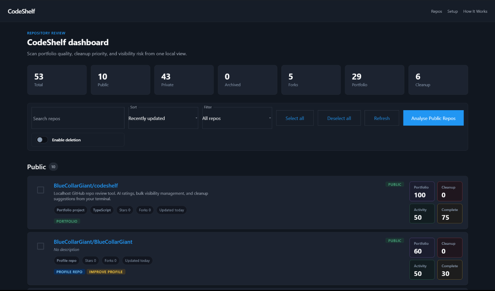

# CodeShelf

A localhost GitHub repository review and management tool for developers.

Inspect your GitHub repositories, review local cleanup and portfolio scores, optionally run AI analysis on public repos only, and manage visibility or deletion with explicit confirmation.

**No accounts. No cloud. No SaaS. Your token stays on your machine.**

---

## What It Does

- Lists public and private GitHub repositories in one local dashboard
- Scores repos locally for portfolio quality, cleanup priority, activity, and completeness
- Flags missing descriptions, old inactive repos, forks, archived repos, and portfolio candidates
- Optionally runs AI analysis on public repos only
- Lets you manually choose repos for visibility changes or deletion
- Shows a mandatory warning and confirmation screen before any write action executes

---

## Screenshots



See [docs/screenshots.md](docs/screenshots.md) for the full media checklist.

---

## Quick Start

Requires Node.js 22.22+ (or 24.15+), available at [nodejs.org/en/download](https://nodejs.org/en/download) (npm is included). An `.nvmrc` is included; `nvm use` picks a compatible version.

```bash
# 1. Clone the repo
git clone https://github.com/BlueCollarGiant/codeshelf.git
cd codeshelf

# 2. Install dependencies
npm run install:all

# 3. Set up your environment
cp .env.example .env
# Edit .env and add your GITHUB_TOKEN at minimum

# 4. Start both servers
npm run dev
```

Open [http://localhost:4200](http://localhost:4200).

All commands run from the `codeshelf` folder (the repo root). No global Angular CLI or Express install is needed; `npm run install:all` installs everything locally inside the project.

The setup screen shows your connection status and walks through missing configuration.

Something not working? See [docs/troubleshooting.md](docs/troubleshooting.md).

---

## GitHub Token Setup

CodeShelf requires a GitHub Personal Access Token in your local `.env` file.
The token is used only by the local Express server. It never reaches Angular, browser storage, AI providers, or API responses.

**Where the token page hides**

GitHub buries token creation four screens deep. The exact path for a classic token:

1. Go to [github.com/settings/profile](https://github.com/settings/profile) (your avatar, then **Settings**)
2. Scroll the left sidebar to the bottom and click **Developer settings**
3. Click **Personal access tokens**, then **Tokens (classic)**
4. Click **Generate new token**, then **Generate new token (classic)**
5. Check the scopes from the table below and click **Generate token**
6. Copy the token immediately (GitHub shows it only once) and add it to `.env`:

```env
GITHUB_TOKEN=ghp_your_token_here
```

Shortcut links that open the form with scopes pre-selected:

- [Token for viewing and visibility changes](https://github.com/settings/tokens/new?description=CodeShelf&scopes=repo) (`repo`)
- [Token including deletion](https://github.com/settings/tokens/new?description=CodeShelf&scopes=repo,delete_repo) (`repo` + `delete_repo`)

**Scopes by feature**

| What you want to do | Classic scopes | Fine-grained permission |
|---|---|---|
| View and score repos | `repo` | Metadata: Read-only |
| Change repo visibility | `repo` | Administration: Read/write |
| Delete repos | `repo` + `delete_repo` | Administration: Read/write |

Note: `delete_repo` is not included in classic `repo`; check it separately if you want deletion.

**Fine-grained tokens (safer if you only need reading)**

Create one at [github.com/settings/personal-access-tokens/new](https://github.com/settings/personal-access-tokens/new) with **Repository access: All repositories** and the permissions from the table. Fine-grained tokens can grant far less than classic `repo`, so they are the better choice for read-only use.

Do not request `workflow`, `admin:org`, package, gist, notification, or user scopes for CodeShelf.

---

## AI Analysis

AI is optional. Set `AI_PROVIDER` in `.env`:

| Provider | Key needed |
|---|---|
| `none` | Disables AI entirely |
| `mock` | No key; returns seeded local test results |
| `openai` | `OPENAI_API_KEY` |
| `anthropic` | `ANTHROPIC_API_KEY` |
| `ollama` | No cloud key; uses local Ollama |

If `AI_PROVIDER` is unset or `none`, AI analysis is disabled: the analyse button is greyed out and the backend rejects analysis requests. The mock provider only runs when explicitly set to `mock`.

AI analysis only receives public repository metadata. Private repos are filtered in backend code before any AI provider is called.

AI results are advisory only. They never select repos, trigger writes, or call GitHub.

---

## Safety Model

- Express binds to `127.0.0.1` only
- CORS is restricted to localhost origins (default `http://localhost:4200`; non-localhost `ALLOWED_ORIGIN` values are rejected)
- The GitHub token lives only in `.env` and `process.env.GITHUB_TOKEN`
- Angular never reads `.env` and never receives the token
- GitHub responses are sanitized before reaching the frontend
- Visibility changes and deletion require manual selection plus confirmation
- CodeShelf is designed for localhost use only; do not deploy it publicly

See [docs/security.md](docs/security.md) for the public security notes.

---

## Demo Walkthrough

No runtime demo mode is built into the app. A future screenshot/GIF walkthrough will show the normal local workflow without adding fake user-facing data paths.

See [docs/demo.md](docs/demo.md) for the planned public walkthrough.

---

## Scripts

| Command | What it does |
|---|---|
| `npm run install:all` | Install root, frontend, and backend dependencies |
| `npm run dev` | Start Angular on port 4200 and Express on port 3000 |
| `npm run dev:frontend` | Start Angular only |
| `npm run dev:backend` | Start Express only |
| `npm run build` | Build the frontend (the backend runs directly from source) |

---

## Stack

| Layer | Choice |
|---|---|
| Frontend | Angular 22 standalone components, signals, OnPush |
| Backend | Node.js + Express, localhost only |
| Auth | GitHub PAT in `.env`, backend-only |
| AI | Adapter pattern selected by `AI_PROVIDER` |
| Storage | None (no browser storage) |
| Database | None |

---

## Documentation

| Guide | Covers |
|---|---|
| [docs/architecture.md](docs/architecture.md) | Frontend/backend structure, data flow, API endpoints, data model, design decisions |
| [docs/scoring.md](docs/scoring.md) | Repo classification rules, all four score formulas, suggestion badges, protected repos |
| [docs/security.md](docs/security.md) | Token handling, scopes, AI boundary, localhost-only model |
| [docs/troubleshooting.md](docs/troubleshooting.md) | Setup, token, AI, and deletion issues |
| [docs/demo.md](docs/demo.md) | What you'll see after setup |
| [docs/screenshots.md](docs/screenshots.md) | Planned media checklist |

---

## Roadmap

- Add screenshots and a short demo GIF/video
- Later: export reports, privacy masking, rate limit display
- Not planned: OAuth, SaaS hosting, database, PR automation, GitHub Actions automation

---

## Contributing

See [CONTRIBUTING.md](CONTRIBUTING.md).

---

## License

MIT. See [LICENSE](LICENSE).
